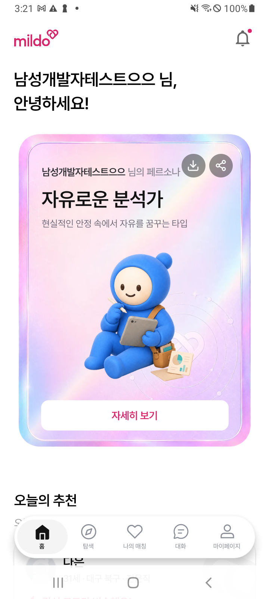
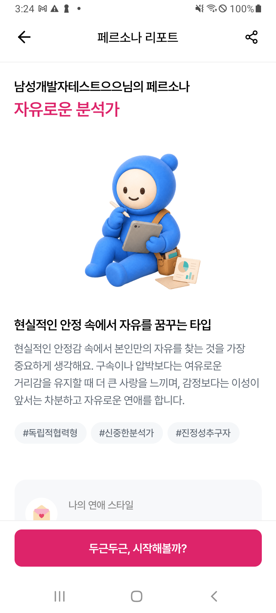
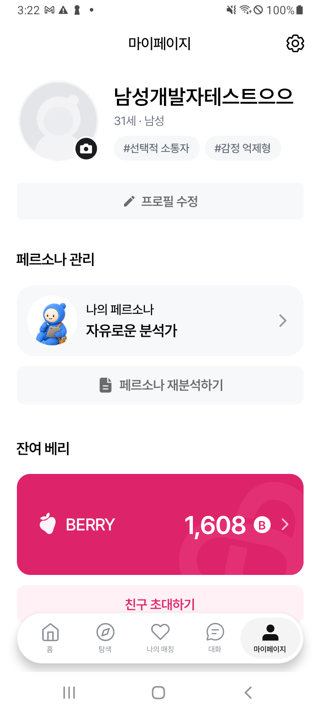
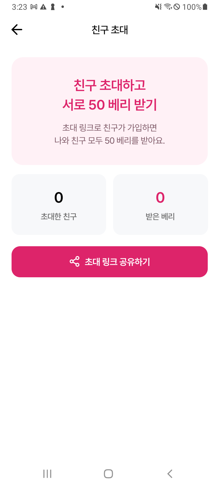

# mildo — Frontend

AI 페르소나 기반 소개팅/매칭 서비스 **mildo**의 프론트엔드입니다.
**하나의 코드베이스**로 iOS·Android 앱과 웹(랜딩 + 관리자 대시보드)을 동시에 빌드하며, 회원가입/온보딩·본인인증·AI 페르소나·매칭·인앱 재화(베리) 결제·친구 초대·관리자 대시보드까지 **0→1로 화면·상태·API 연동·빌드/배포 파이프라인을 직접 설계·구현·운영**한 실서비스입니다.

> 이 저장소는 **포트폴리오용 발췌본**입니다. 실서비스 코드에서 API 키·서버 주소·개인정보 등 민감 정보를 모두 제거하거나 placeholder로 치환하고, 제가 설계를 주도한 대표 코드와 설계 문서만 담았습니다.
>
> 🔗 **백엔드(Java · Spring Boot)는 같은 서비스의 서버로 [`be` 브랜치](https://github.com/eomheeseung/mildo_eomheeseung/tree/be)에 있습니다.** 이 서비스는 프론트/백엔드를 **한 사람이 0→1로 설계·구현·배포·운영**했습니다.

---

## 기술 스택

| 구분 | 사용 기술 |
|---|---|
| Core | **React Native · Expo**, **TypeScript** |
| 라우팅 | **Expo Router** (파일 기반, `app/` = 라우트) |
| 상태 | React **Context**(세션/테마) + 서버 상태(로컬) + AsyncStorage(pending) — *전역 스토어 미사용, 의도적* |
| 통신 | **Axios** — 인터셉터(토큰 자동 리프레시) + 통일 envelope |
| 어트리뷰션/딥링크 | AppsFlyer(OneLink deferred) + expo-linking(스킴 백업) |
| 결제 | Apple / Google 인앱결제 (네이티브 모듈 격리) |
| 실시간/알림 | SSE, FCM, Web Push |
| 빌드/배포 | Expo prebuild · Gradle(AAB) · 웹 export, **릴리즈 env 가드 자체 구현** |

---

## 아키텍처 한눈에

```
                 하나의 소스(app/ · src/)
                          │
        ┌─────────────────┼──────────────────┐
        ▼                 ▼                  ▼
   iOS / Android        웹 랜딩           관리자 대시보드(웹)
        │                 │                  │
        └──── 공통 API 레이어(axios) ── 인터셉터 · 통일 envelope ────┐
                                                                 ▼
                                        base URL = 런타임 해석(env.ts)
                                   웹: 브라우징 도메인 추종 / 네이티브: 빌드 값(폴백=운영)
```

파일 기반 라우팅으로 진입점을 얇게 두고, 화면은 `src/screens`, 사이드이펙트는 `src/services`, 서버 통신은 `src/api/client` 한 곳으로 모았습니다. 네이티브 전용 모듈은 동적 require로 감싸 **웹 번들이 깨지지 않게** 격리했습니다. → [`docs/architecture.md`](./docs/architecture.md)

---

## 스크린샷

> 실기기(Android) 캡처 · 데이터는 테스트 계정, 타인 식별정보는 마스킹 처리.

**⭐ 핵심 — 매칭 상대의 AI 페르소나와 대화**
사용자의 12문항·MBTI로 만든 페르소나를 AI가 1인칭으로 연기해, 실제로 만나기 전에 대화로 상대를 미리 알아본다.

<p align="center">
  
</p>

| 홈 | 페르소나 리포트 | 마이페이지 | 친구 초대 |
|:---:|:---:|:---:|:---:|
|  |  |  |  |
| AI 페르소나 카드 | AI 분석 리포트 | 프로필·재화(베리)·초대 | 친구 초대(리퍼럴) |

---

## 하이라이트 — 설계 판단이 담긴 부분

리뷰어가 코드로 바로 볼 수 있도록 [`code-excerpts/`](./code-excerpts)에 담았습니다.

### 1. 하나의 코드베이스, 여러 환경 — 그리고 오배포를 빌드가 막는다
[`env.ts`](./code-excerpts/env.ts) · [`validate-release-env.cjs`](./code-excerpts/validate-release-env.cjs)

- base URL을 하드코딩하지 않는다. **웹은 브라우징 중인 도메인을 그대로 따라가고**(dev/운영 자동), 네이티브는 빌드에 구운 값을 쓰되 **없으면 반드시 운영으로 폴백**(fail-safe).
- Expo가 `.env.local`을 `.env`보다 우선하는 특성 때문에, 로컬 서버 주소가 릴리즈에 박히는 사고가 있었다. → **Expo와 동일한 우선순위로 실제 값을 재현해, 릴리즈에서 사설망 URL이면 빌드 자체를 실패**시키는 가드를 만들어 `app.config.js`·`build.gradle`에 물렸다. 사람의 주의력이 아니라 파이프라인이 오배포를 막게 했다.

### 2. "다음 화면"은 서버가 안다 — 서버 응답 기반 라우팅
[`signupFlow.ts`](./code-excerpts/signupFlow.ts)

- 다단계 가입(본인인증→동의→설문→리포트)의 다음 화면을 **로컬 화면 스택이 아니라 서버 signup-status로 결정**하는 순수 함수(`getSignupStepRoute`)로 분리. 앱 재시작·재로그인·기기 변경에도 같은 자리로 복원된다.
- **계정 생성 전엔 `/users/me/*`를 못 쓴다(403).** 동의·초대자를 로컬(`pending_*`)에 들고 있다가 가입 body에 실어 보내고, 가입 후 재확정(멱등)한다 → **백엔드 배포 순서에 무관하게** 동작(deploy-order-safe).

> `push-consent 403`을 처음엔 "토큰 미첨부"로 오진했다가, 실제로는 계정이 없어 `/users/me`를 못 치는 것이 원인임을 재규명 → deploy-order-safe로 재설계했다.

### 3. 리퍼럴 딥링크 — deferred + 직접 진입 이중 캡처
[`analytics.ts`](./code-excerpts/analytics.ts)

- 초대 링크는 앱 미설치(설치 후 첫 실행=deferred)와 설치됨(스킴 직접 진입) 둘 다 잡아야 초대자를 귀속시킬 수 있다.
- AppsFlyer UDL이 raw 스킴을 못 잡는 케이스를 콜백 로깅으로 확인 → **expo-linking으로 스킴을 직접 파싱하는 백업 경로**를 얹어 이중화. `inviterId`는 백엔드가 유효성을 판단하므로 프론트는 검증 없이 best-effort로 실어 책임 경계를 단순화.

### 4. 회복탄력적 API 레이어 + graceful degradation
[`apiClient.ts`](./code-excerpts/apiClient.ts) · [`RevenueReportTab.tsx`](./code-excerpts/RevenueReportTab.tsx)

- **401 → refresh → 원요청 자동 재시도** 인터셉터 + 성공/실패 통일 envelope `{success,data,message,code}` → 화면은 토큰 만료·엔드포인트를 몰라도 된다.
- 관리자 대시보드는 **백엔드 연동 전에도 깨지지 않게** 로딩/빈상태/미연동을 명시적으로 렌더. 금액 표시는 "합산은 서버 정밀값, 화면은 표시만 반올림"으로 분리(광고비 소수점 대응).

### 5. 푸시 도달률 27% — 고칠 대상은 사용자가 아니라 계측이었다
[`pushPermission.ts`](./code-excerpts/pushPermission.ts) · [`usePushPrimer.ts`](./code-excerpts/usePushPrimer.ts)

```
등록 사용자 288명  →  배달 가능 79명(27%)  |  권한 보고 86명 중 거부 58명(67%)
```

- 처음 해석은 *"67%가 거부했으니 가입 시점 팝업이 문제"* 였다. **틀린 해석이었다.** 측정된 건 거부율뿐이고 *언제* 거부했는지는 데이터에 없었다.
- **실제 원인은 계측 코드였다.** 안드로이드에는 iOS의 `undetermined`(아직 안 물어봄)가 없다 — 한 번도 묻지 않은 기기도 `status='denied'`로 온다. 구분은 `canAskAgain` 하나뿐인데 `status`를 그대로 보고하고 있었다. **신규 설치자가 전부 거부자로 집계**되고 있었고, 같은 이유로 권한 요청이 `undetermined` 게이트에 막혀 **안드로이드에서는 OS 팝업이 한 번도 뜨지 않았다.** 거부율이 높았던 게 아니라 묻지를 않고 있었다.
- **설계로 되돌린 것**: 판정을 한 곳(`getPermissionStatus`)으로 모으고, 권한 팝업의 **기본값을 "안 띄움"으로 뒤집었다.** iOS 팝업은 기기당 사실상 1회라 실수의 대가가 되돌릴 수 없는 쪽으로 열려 있으면 안 된다 → 띄우는 지점은 "왜 필요한지 설명한 화면" 한 곳뿐.
- OS 권한 상태는 **서버에 저장하지 않았다.** 사용자가 설정 앱에서 언제든 바꾸고 앱은 그 이벤트를 못 받으므로, 저장하면 반드시 어긋난다. **토큰 존재 유무 자체를 배달 가능 신호**로 삼아 상태를 한 곳에만 뒀다.

---

## 그 외 구현 범위

- **가입 게이트** — 소셜(카카오/네이버/애플) + 이메일 + NICE 본인인증. 중복 인증(1인 1계정) 에러를 도메인 코드로 분기해 안내.
- **웹 3면** — 데스크탑/태블릿/모바일 랜딩(OS 분기 다운로드) + 관리자 대시보드(유저·매칭·신고·매출·광고비·친구추천).
- **인앱 재화(베리)** — 차감 전 확인/부족 시 충전 유도 모달, 서버 원장 기반 잔액.
- **관리자 대시보드** — 시계열/퍼널 분석, 매출·광고비(ROAS·순이익) 대시보드, 데이터 미연동 시 안전한 폴백.
- **알림 시스템** — 전체화면 알림함(날짜 구간 SectionList) + 유형별 수신 설정(마스터/세부/마케팅 3층) + 프리퍼미션·거부자 회수 동선. FCM 토큰 로테이션·멱등 구독으로 조용한 유실 차단.
- **피드·댓글** — 게시물 피드, 댓글/대댓글(2단계), 좋아요, 신고·차단 반영.
- **다크모드/다국어** — 테마 토큰 기반 자동 대응, i18n 키 기반.

---

## 트러블슈팅 (실운영)

문서: [`docs/troubleshooting.md`](./docs/troubleshooting.md)

- **로컬 서버 주소가 프로덕션에 박힘** — `.env.local` 우선순위 함정 → 빌드 타임 가드로 재발 차단
- **릴리즈에서 어트리뷰션이 통째로 죽음** — SDK 키가 릴리즈에서 비활성되는 env에만 있었음 → 운영 env로 이동 + 번들 검증
- **리퍼럴 딥링크 미캡처** — AppsFlyer UDL이 raw 스킴 미처리 → expo-linking 백업 경로 이중화
- **비ASCII 사용자 경로 Android 빌드 크래시** — Gradle 캐시/TEMP를 ASCII로 강제
- **푸시 거부율이 부풀려 집계됨** — 안드로이드엔 `undetermined`가 없어 신규 설치자가 거부자로 잡힘 → `canAskAgain` 기준으로 판정 일원화
- **포그라운드 알림이 통째로 유실** — 채널 없는 즉시 트리거가 네이티브에서 NPE(JS로 안 올라옴) → 플랫폼별 트리거 분기
- **24시간마다 로그아웃** — 서버가 만료 토큰에 `401` 대신 `403`을 반환해 갱신이 발화하지 않음 → 원인을 서버로 특정하고, `403`을 갱신 트리거에 넣는 편법은 거절

---

## 개발 방식 — AI 협업

이 프로젝트는 **Claude (Claude Code)를 페어 프로그래밍 도구로 함께 활용**해 개발했습니다.
요구사항 정의·아키텍처 방향·문제 진단·설계 트레이드오프 판단을 주도하면서, 구현·리팩터링·문서화·트러블슈팅에 Claude를 적극 활용했습니다. AI 도구를 실서비스 개발 워크플로에 통합해 **판단은 사람이, 반복 작업은 AI가** 맡는 방식으로 생산성을 끌어올렸습니다.

---

## 문서

- [`docs/architecture.md`](./docs/architecture.md) — 아키텍처 · 구조
- [`docs/state-management.md`](./docs/state-management.md) — 상태관리 전략(왜 전역 스토어를 안 썼나)
- [`docs/screen-flows.md`](./docs/screen-flows.md) — 주요 화면 플로우(가입 라우팅·리퍼럴·베리)
- [`docs/api-and-build.md`](./docs/api-and-build.md) — API 연동 · 환경 해석 · 빌드/배포
- [`docs/troubleshooting.md`](./docs/troubleshooting.md) — 실운영 트러블슈팅(증상 → 원인 → 해결, 실측 데이터)
- [`docs/engineering-decisions.md`](./docs/engineering-decisions.md) — 엔지니어링 결정(고르지 않은 선택지와 그 이유)
