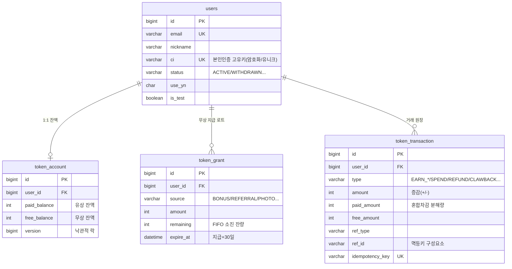
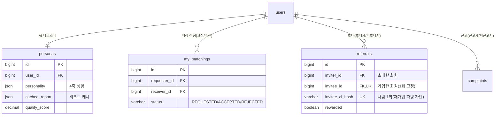
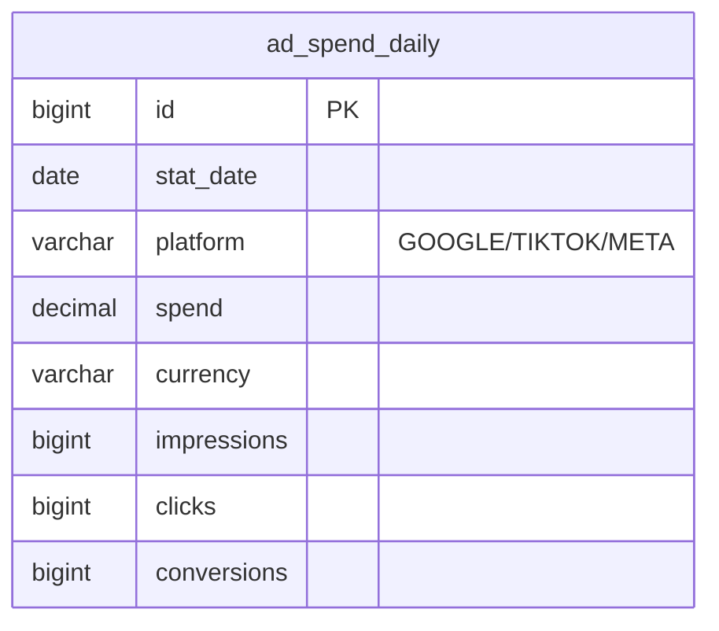

# 데이터 모델 (ERD)

핵심 도메인의 데이터 설계입니다. (전체 스키마 중 대표 테이블만 발췌 — 컬럼도 핵심만.)

## 재화(베리) — 원장 중심

베리 시스템의 핵심은 **원장(`token_transaction`)** 입니다. 잔액(`token_account`)은 파생 캐시이고,
무상 베리는 만료 로트(`token_grant`) 단위로 관리합니다.

**멱등 유니크 제약**
- `token_transaction.idempotency_key` UNIQUE — 결제 재시도 dedup
- `(type, ref_type, ref_id)` UNIQUE — 1회성 적립/차감 중복 차단 (예: 가입 보너스 = `EARN_BONUS + SIGNUP + SHA256(CI)`)

## 회원·페르소나·매칭

## 광고비 집계

`(stat_date, platform)` UNIQUE — 일 배치가 최근 N일을 재조회해 **멱등 upsert**(지연 반영·정정분 덮어쓰기).

## 설계 포인트

- **`users.ci` 유니크** — NICE 본인인증 고유키로 1인 1계정 강제.
- **베리 잔액은 원장의 파생값** — 정합성 문제 시 원장 재생으로 복구 가능.
- **1회성 보상의 멱등키에 `사람(CI 해시)`** 포함 — 탈퇴/재가입 파밍을 데이터 레벨(유니크 제약)에서 차단.
- **모든 다대다·자기참조 관계**(매칭·초대·신고)는 두 유저 컬럼(요청/수신 등)으로 표현.
