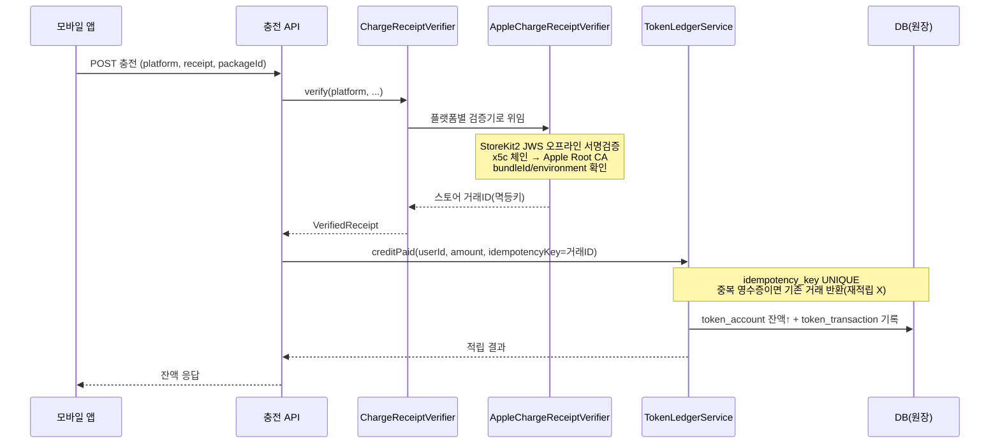
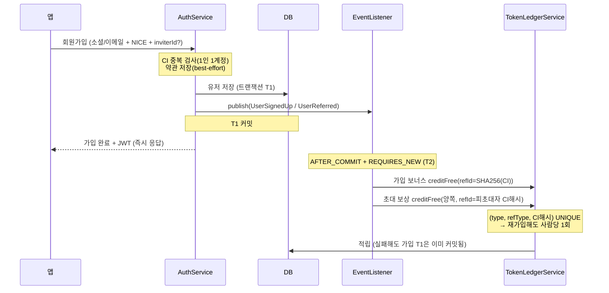

# 주요 플로우 (시퀀스)

핵심 흐름 두 가지를 시퀀스로 정리했습니다. 설계에서 중요한 **트랜잭션 경계**와 **멱등 지점**에 주석을 달았습니다.

## 1. 인앱 결제 → 베리 적립

애플/구글 영수증을 **서버가 직접 검증**하고, 검증된 스토어 거래 ID를 멱등키로 원장에 적립합니다.

**핵심**
- 검증 실패/미지원 플랫폼은 적립 전에 차단.
- 같은 영수증이 재전송돼도 `idempotency_key` 유니크로 **이중 적립 불가**.
- 애플 서버 왕복 없이 서명만으로 검증 → 외부 지연/장애에 덜 의존.

## 2. 회원가입 → 보너스·초대 보상 (트랜잭션 분리)

가입 트랜잭션이 **커밋된 뒤** 보너스·초대·전환 이벤트를 별도 트랜잭션에서 처리합니다.
→ 보상 로직이 실패해도 **회원가입 자체는 절대 롤백되지 않습니다.**

**핵심**
- 가입은 사용자 경험의 최우선 → 부가 로직(보상·이벤트)이 볼모로 잡지 않음.
- 잘못된 `inviterId`(없는 유저·자기 자신·탈퇴)는 예외 없이 **초대만 스킵**.
- 보상 멱등키가 `사람(CI 해시)`이라, 탈퇴 후 재가입해도 재지급 안 됨.
