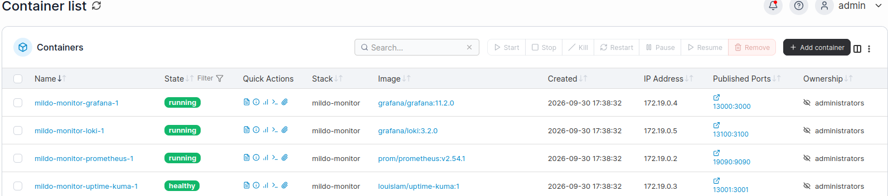
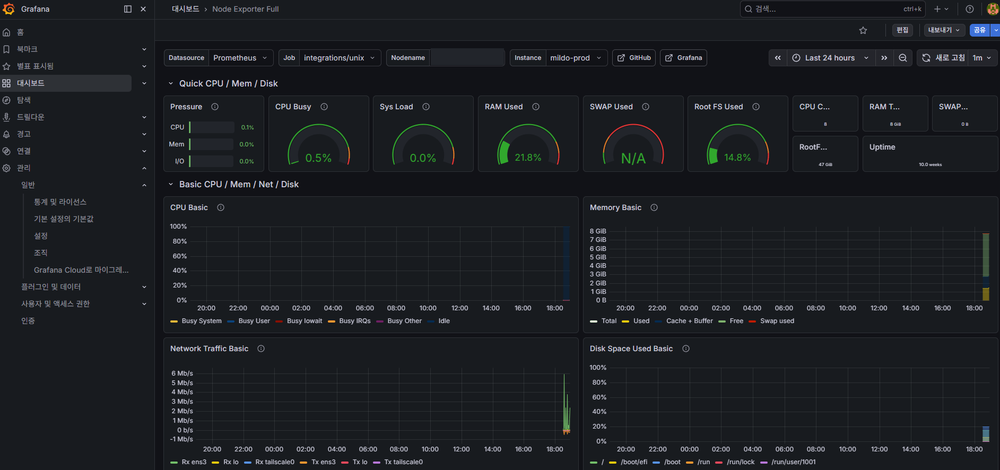
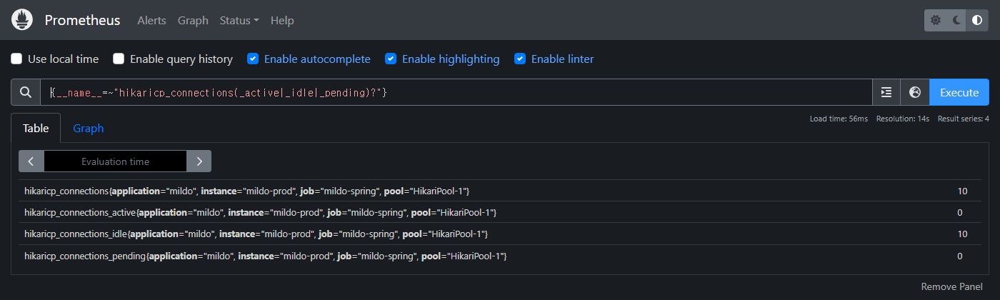
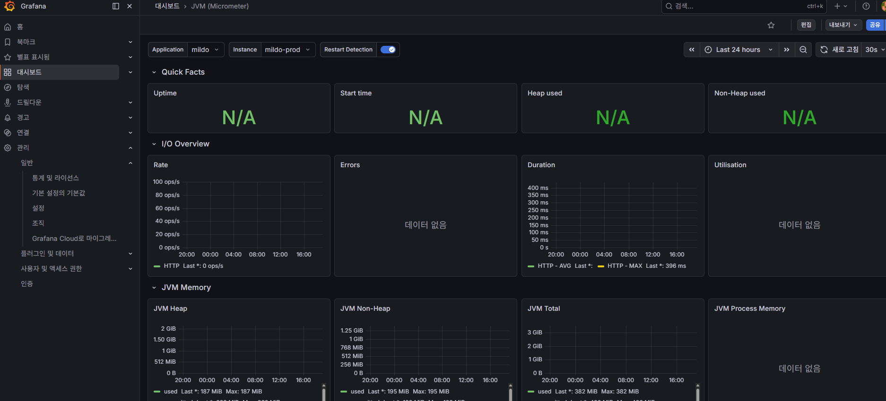
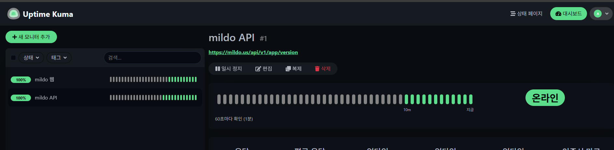

# 운영 모니터링 인프라 구축기 — 사무실 PC 한 대를 모니터링 서버로

> 2026-09-30, 하루 작업. 비용 0원.
> 운영 서버 1대짜리 서비스에 **로그·지표·생사 확인**을 붙였다. 클라우드 모니터링 상품을 쓰지 않고,
> 사무실에 있던 Ubuntu PC 한 대에 Grafana·Loki·Prometheus·Uptime Kuma 를 올리고
> 운영 서버의 수집기(Grafana Alloy)가 사설망(Tailscale)으로 데이터를 밀어 넣는 구조다.
>
> 처음 해 보는 작업이었다. 그래서 **결과뿐 아니라 개념과, 막혔던 지점과, 막힌 이유**를 같이 적는다.
> 같은 구성을 처음 하는 사람이 이 문서 하나로 끝까지 갈 수 있게 쓰는 것이 목표다.

문서 안의 IP·경로·호스트명은 예시 값으로 바꿨다(`100.x.x.10` 등). 비밀번호·키는 싣지 않는다.

## 목차

1. [왜 필요했나](#1-왜-필요했나)
2. [개념부터 — 지표·로그·생사 확인은 다른 것이다](#2-개념부터--지표로그생사-확인은-다른-것이다)
3. [풀어야 했던 문제 — 세 기기가 서로 닿지 않는다](#3-풀어야-했던-문제--세-기기가-서로-닿지-않는다)
4. [전체 구조](#4-전체-구조)
5. [사설망(Tailscale) — 시행착오 전 과정](#5-사설망tailscale--시행착오-전-과정)
6. [모니터링 서버 — Docker Compose 스택](#6-모니터링-서버--docker-compose-스택)
7. [운영 서버 — 수집기(Grafana Alloy)](#7-운영-서버--수집기grafana-alloy)
8. [Spring 지표 — 별도 포트로 빼고, 보안 규칙을 포트로 가른다](#8-spring-지표--별도-포트로-빼고-보안-규칙을-포트로-가른다)
9. [Grafana — 비밀번호·프로비저닝·업그레이드·대시보드](#9-grafana--비밀번호프로비저닝업그레이드대시보드)
10. [Uptime Kuma — 무엇을 봐야 하나](#10-uptime-kuma--무엇을-봐야-하나)
11. [알림 규칙 — 기준값과 근거](#11-알림-규칙--기준값과-근거)
12. [검증 — "설정했다"가 아니라 "들어왔다"를 확인한다](#12-검증--설정했다가-아니라-들어왔다를-확인한다)
13. [밟은 함정 13가지](#13-밟은-함정-13가지)
14. [한계와 다음 단계](#14-한계와-다음-단계)

---

## 1. 왜 필요했나

그동안 장애는 **사용자 제보나 우연한 로그 확인**으로 알았다. 9월에만 이런 일이 있었다.

| 사건 | 실제로 안 시점 | 모니터링이 있었다면 |
|---|---|---|
| 외부 AI API 월 한도 초과로 가입 마지막 단계가 6시간 막힘 | **이틀 뒤** 다른 작업 중 발견 | 로그 한 줄(`usage limits`) 알림으로 수 분 |
| 프로필 사진 업로드가 주말 내내 503 (330건) | 월요일 아침 | 5xx 비율 알림으로 수 분 |
| DB 유휴 커넥션 타임아웃 불일치로 간헐 500 | nginx 로그를 역추적하다 | 커넥션 대기 지표로 바로 |
| 배포 직후 앱이 안 뜸(명령 줄바꿈 실수, 1분 다운) | 직접 접속해 보고 | 생사 확인 1분 |

공통점은 **서버는 알고 있었는데 사람에게 말해 줄 경로가 없었다**는 것이다. 로그에는 다 찍혀 있었다.
로그를 "사고 난 뒤 뒤지는 것"에서 "사고를 알려 주는 것"으로 바꾸는 작업이다.

클라우드 모니터링 상품(Datadog, Grafana Cloud 등)을 쓰지 않은 이유는 규모다. 서버 1대, 하루 로그 수십 MB.
이 규모에서 월 과금 상품은 과하고, 사무실에 24시간 켜 둘 수 있는 PC 가 한 대 있었다.

---

## 2. 개념부터 — 지표·로그·생사 확인은 다른 것이다

처음에 가장 헷갈린 부분이라 먼저 정리한다. "모니터링 도구"라고 뭉뚱그려 부르지만 넷은 하는 일이 다르다.

| 도구 | 저장하는 것 | 답하는 질문 | 비유 |
|---|---|---|---|
| **Prometheus** | 시계열 **숫자** (CPU %, 메모리, 응답시간, 요청 수) | "지금 얼마나? 추세는?" | 속도계 |
| **Loki** | **로그 문자열** (에러 메시지, 접근 기록) | "그때 무슨 일이 있었나?" | 블랙박스 |
| **Grafana** | 없음 — 위 둘을 조회해 **보여 주기만** 한다 | (화면·알림) | 계기판 |
| **Uptime Kuma** | 없음 — 60초마다 직접 HTTP 요청 | "살아 있나?" | 엔진 경고등 |

### 지표(metric)와 로그(log)의 차이

- **지표는 미리 정한 숫자를 주기적으로 찍는다.** `hikaricp_connections_active = 3` 같은 값을 30초마다.
  싸고 빠르고 추세를 보기 좋지만, "왜"는 말해 주지 않는다.
- **로그는 일어난 일을 문장으로 남긴다.** 비싸고(용량) 느리지만(검색), 원인이 들어 있다.
- 그래서 **지표로 "이상하다"를 알고, 로그로 "왜"를 찾는다.** 둘 다 필요한 이유다.

### 긁어 오기(pull)와 밀어 넣기(push)

Prometheus 의 기본 방식은 **pull** 이다. Prometheus 가 대상 서버의 `/metrics` 주소를 주기적으로 읽어 간다(scrape).
반대로 **push** 는 대상 쪽이 데이터를 보내는 방식이다. 이 구분이 이번 구성의 핵심 제약이 된다(→ §3).

### 라벨(label)과 카디널리티

지표와 로그에는 `job="mildo-app"`, `level="ERROR"`, `status="500"` 같은 **라벨**이 붙고, 조회는 라벨로 한다.
라벨 값의 가짓수(카디널리티)가 늘면 저장 비용이 곱으로 는다. **값이 몇 가지로 정해진 것만 라벨로** 올린다 —
로그 레벨(4가지)은 라벨로 좋고, 사용자 ID 나 요청 경로 전체는 나쁘다.

### ELK 가 아니라 PLG

로그 수집의 유명한 조합은 ELK(Elasticsearch·Logstash·Kibana)다. 본문 전체를 색인해 검색이 강력하지만
Elasticsearch 혼자 메모리 수 GB 를 쓴다. **PLG**(Promtail·Loki·Grafana)는 본문을 색인하지 않고 **라벨만 색인**해서
훨씬 가볍다. 이 규모에는 PLG 가 맞다. 다만 Promtail 은 지원이 끝나 후속인 **Grafana Alloy** 를 쓴다.
Alloy 는 로그 수집기이면서 지표 수집기(서버 자원 exporter 내장, scrape, remote write)라 에이전트가 하나로 끝난다.

---

## 3. 풀어야 했던 문제 — 세 기기가 서로 닿지 않는다

```
[운영 서버]             공인 IP, 호스팅 업체
[사무실 PC(모니터링)]    사설 공유기 뒤, 포트포워딩 없음 → 밖에서 들어올 수 없다
[관리자 노트북]          카페·집 등 위치가 계속 바뀐다
```

두 가지가 막힌다.

1. **로그는 운영 서버가 사무실 PC 로 보내야 한다(push).** 그런데 사무실 PC 는 공유기 뒤라 밖에서 연결을 열 수 없다.
2. **Prometheus 의 기본인 pull 을 쓰려면** 사무실 PC 가 운영 서버의 지표 포트를 읽어야 한다.
   그러려면 운영 서버에 지표 포트를 인터넷으로 열어야 하는데, 서버 내부 정보를 공개하는 셈이다.

공유기에 포트포워딩을 걸면 1번은 풀리지만 사무실 PC 가 인터넷에 노출된다. 어느 쪽도 포트를 여는 방향은 싫었다.

**해법 두 가지를 같이 썼다.**

- **Tailscale**(WireGuard 기반 메시 VPN)로 세 기기를 한 사설망에 묶는다. 각 기기가 **밖으로 나가는 연결**만으로
  서로를 찾으므로 인바운드 포트를 하나도 열지 않는다. 사설망 안에서는 `100.x.x.x` 주소로 서로 닿는다.
- **지표도 push 로 뒤집는다.** Prometheus 는 아무것도 긁지 않고(`scrape_configs: []`) **remote write 수신기**만 켠다.
  운영 서버의 Alloy 가 자기 서버 안에서 지표를 긁어(localhost) 사설망으로 밀어 넣는다.
  그래서 운영 서버의 지표 포트는 **127.0.0.1 에만** 열면 된다.

---

## 4. 전체 구조

```
┌─────────────────────────────┐    Tailscale 사설망 (100.64.0.0/10)   ┌──────────────────────────────┐
│ 운영 서버  mildo-prod        │ ═══════════ push ═══════════════════▶ │ 사무실 PC  mildo-monitor       │
│ 100.x.x.20                  │                                       │ 100.x.x.10                    │
│                             │                                       │                               │
│ Spring Boot (서비스 :8090)   │                                       │  Docker Compose (4개)          │
│   └ 지표 :8091 (127.0.0.1)  │─┐                                     │                               │
│ nginx access / error log    │─┤                                     │  Loki        :13100 ◀─ 로그    │
│ app.YYYY-MM-DD.log          │─┼─▶ Grafana Alloy ───────────────────▶│  Prometheus  :19090 ◀─ 지표    │
│ CPU · 메모리 · 디스크        │─┘    (수집기, systemd)                 │        ▲          ▲            │
└─────────────────────────────┘                                       │        └── Grafana :13000     │
                                                                      │                               │
             https://서비스도메인/api/... ◀─── 60초마다 HTTP ──────────│  Uptime Kuma :13001           │
                                                                      └──────────────▲────────────────┘
                                                                                     │ Tailscale
                                                                        ┌────────────┴───────────┐
                                                                        │ 관리자 노트북 (브라우저)  │
                                                                        └────────────────────────┘
```

- 굵은 화살표(═▶)가 사설망을 지나는 유일한 데이터 경로다. **방향은 항상 운영 서버 → 사무실 PC.**
- Uptime Kuma 만 예외로, 사무실 PC 에서 **공개 도메인**으로 직접 요청한다. 사용자가 보는 경로와 같은 경로를 확인하기 위해서다.
- Uptime Kuma 는 나머지 셋과 **독립**이다. Grafana·Loki·Prometheus 가 전부 죽어도 혼자 감시하고 알린다.

| 구성요소 | 위치 | 버전 | 자원 |
|---|---|---|---|
| Tailscale | 세 기기 전부 | 1.102 | — |
| Grafana | 사무실 PC | 12.4 | 컨테이너 |
| Loki | 사무실 PC | 3.2 | 보관 30일 |
| Prometheus | 사무실 PC | 2.54 | 보관 30일 |
| Uptime Kuma | 사무실 PC | 2.x | — |
| Grafana Alloy | 운영 서버 | 1.20 | 메모리 약 220MB |

---

## 5. 사설망(Tailscale) — 시행착오 전 과정

### 5-1. 첫 시도: 회사 도메인 계정 → 승인 교착

회사 구글 워크스페이스 계정으로 로그인했다.

```bash
$ curl -fsSL https://tailscale.com/install.sh | sh
$ sudo tailscale up --hostname=mildo-monitor
To authenticate, visit:
    https://login.tailscale.com/a/xxxxxxxxxxxx
```

링크에서 로그인하자 승인 대기가 두 번 연달아 걸렸다.

```
1차  "Admins of this tailnet must approve you before you can join."      ← 기기 승인 대기
2차  "You have logged in to the <회사도메인> tailnet. However, you can't
      connect until one of the network administrators approves your access."   ← 사용자 승인 대기
```

**원인.** 로그인 이메일이 조직 도메인이면 Tailscale 은 "이 도메인 전체가 공유하는 사설망"으로 보고 관리자 승인을 요구한다.
누가 켠 정책이 아니라 **도메인 기반 기본 동작**이다. 그런데 이 사설망은 지금 처음 만드는 것이라 승인해 줄 관리자가 없다.
승인할 사람이 없는 승인 대기, 교착이다.

### 5-2. 해결: 개인 계정으로 전환

```bash
$ sudo tailscale logout
$ sudo tailscale up --hostname=mildo-monitor
```

개인 계정으로 처음 만드는 사설망은 로그인한 사람이 곧 관리자라 승인 절차가 없다. 즉시 붙었다.

- 일반 브라우저 창에는 앞서 로그인한 회사 계정 세션이 남아 `Error 400: tailnet mismatch` 가 난다. **시크릿 창**에서 로그인한다.

### 5-3. 화면이 없는 서버에서 로그인하기

운영 서버는 GUI 가 없다. `tailscale up` 이 출력한 URL 을 **아무 기기의 브라우저**(노트북·휴대폰)에 붙여 넣고 로그인하면 된다.
브라우저를 연 기기와 사설망에 등록되는 기기는 무관하다. **어느 계정으로 로그인하느냐**만 중요하다.

```bash
$ tailscale up --hostname=mildo-prod
Access denied: checkprefs access denied
Use 'sudo tailscale up --hostname=mildo-prod'.
```

`sudo` 가 필요한 이유는 가상 네트워크 인터페이스(`tailscale0`)를 만들고 라우팅 테이블을 바꾸기 때문이다. 다른 VPN 클라이언트도 같다.

### 5-4. 연결 확인

```bash
$ tailscale status
100.x.x.20   mildo-prod      account@  linux  -
100.x.x.10   mildo-monitor   account@  linux  -

$ tailscale ping -c 2 mildo-monitor
pong from mildo-monitor (100.x.x.10) via DERP(tok) in 75ms
direct connection not established
```

`via DERP` 는 두 기기가 직접 연결을 못 잡아 Tailscale 의 **중계 서버**를 거친다는 뜻이다. 양쪽 다 NAT 뒤라 흔한 일이고,
75ms 면 로그·지표 전송에 아무 문제 없다. 조건이 맞으면 나중에 직접 연결(P2P)로 바뀌기도 한다.

### 5-5. 이름으로 접속이 안 될 때

노트북 브라우저에서 `http://mildo-monitor:13000` 이 `DNS_PROBE_FINISHED_NXDOMAIN` 으로 실패했다.
기기 이름을 주소로 풀어 주는 **MagicDNS** 가 꺼져 있어서다. 관리 화면 DNS 메뉴에서 켜거나, 그냥 `100.x.x.10` 으로 접속한다.
같은 사무실 내부망에 있는 기기는 Tailscale 없이 **사내 IP** 로 바로 접속된다. Tailscale 은 밖에서 볼 기기에만 필요하다.

| 접속하는 곳 | 필요한 것 | 주소 |
|---|---|---|
| 사무실 안 | 없음 | `http://<사내 IP>:13000` |
| 사무실 밖 | Tailscale 로그인 | `http://100.x.x.10:13000` |

### 5-6. 팀원 추가

- **계정 공유**: 같은 계정으로 로그인. 승인 없음.
- **각자 계정**: 팀원이 본인 계정으로 로그인 → "User approval required" → 관리자가 승인.
  이번 승인 대기는 5-1 과 달리 정상 절차다(남이 내 사설망에 들어오려는 것). 승인 뒤 팀원이 **한 번 더 로그인**해야 붙는다.

---

## 6. 모니터링 서버 — Docker Compose 스택

### 6-1. 포트 충돌 → 1만 번대로 격리

원래 계획은 Grafana 3000, Loki 3100, Prometheus 9090, Uptime Kuma 3001 이었다. 그런데 그 PC 의 3000번을 다른 사내 서비스가 쓰고 있었다.

```bash
$ ss -ltnp | grep ':3000 '
LISTEN 0 4096 0.0.0.0:3000 users:(("docker-proxy",pid=...))
```

하나만 옮기면 또 겹칠 수 있어서 **전부 1만 번대**로 올렸다.

| 서비스 | 컨테이너 내부 포트 | 호스트 포트 |
|---|---|---|
| Grafana | 3000 | **13000** |
| Loki | 3100 | **13100** |
| Prometheus | 9090 | **19090** |
| Uptime Kuma | 3001 | **13001** |

이 변경이 나중에 두 번 발목을 잡았다(→ 함정 4·5). 포트를 바꿨으면 **그 포트를 아는 모든 곳**(수집기 설정, 점검 스크립트, 문서)을 같이 바꿔야 한다.



### 6-2. docker-compose.yml

```yaml
services:
  grafana:
    image: grafana/grafana:12.4.12
    ports: ["13000:3000"]
    environment:
      GF_SECURITY_ADMIN_USER: admin
      # GF_SECURITY_ADMIN_PASSWORD 는 최초 1회만 적용된다 → §9-1
    volumes: ["grafana-data:/var/lib/grafana"]
    restart: unless-stopped

  loki:
    image: grafana/loki:3.2.0
    ports: ["13100:3100"]
    command: -config.file=/etc/loki/config.yaml
    volumes:
      - ./loki/config.yaml:/etc/loki/config.yaml
      - loki-data:/loki
    restart: unless-stopped

  prometheus:
    image: prom/prometheus:v2.54.1
    ports: ["19090:9090"]
    command:
      - --config.file=/etc/prometheus/prometheus.yml
      - --storage.tsdb.retention.time=30d
      - --web.enable-remote-write-receiver     # ← 핵심: 긁지 않고 받는다
    volumes:
      - ./prometheus/prometheus.yml:/etc/prometheus/prometheus.yml
      - prom-data:/prometheus
    restart: unless-stopped

  uptime-kuma:
    image: louislam/uptime-kuma:2
    ports: ["13001:3001"]
    volumes: ["kuma-data:/app/data"]
    restart: unless-stopped

volumes:
  grafana-data: {}
  loki-data: {}
  prom-data: {}
  kuma-data: {}
```

`prometheus/prometheus.yml` 은 사실상 비어 있다.

```yaml
global:
  scrape_interval: 30s
scrape_configs: []     # 아무것도 긁지 않는다. 운영 서버가 remote write 로 밀어 넣는다
```

### 6-3. Loki — 단일 노드, 로컬 디스크

```yaml
auth_enabled: false
server:
  http_listen_port: 3100
common:
  path_prefix: /loki
  storage:
    filesystem:
      chunks_directory: /loki/chunks
      rules_directory: /loki/rules
  replication_factor: 1
  ring:
    kvstore:
      store: inmemory
schema_config:
  configs:
    - from: 2026-09-01
      store: tsdb
      object_store: filesystem
      schema: v13
      index:
        prefix: index_
        period: 24h
limits_config:
  retention_period: 720h        # 30일
compactor:
  working_directory: /loki/compactor
  retention_enabled: true       # 이게 없으면 retention_period 만 적어도 지워지지 않는다
  delete_request_store: filesystem
```

S3 같은 오브젝트 스토리지 없이 로컬 파일로만 돈다. 세 저장소 모두 외부 DB 가 없다
(Grafana 는 SQLite, Loki 는 chunk 파일, Prometheus 는 자체 TSDB). 서버 1대 규모에서는 이게 가장 단순하다.

### 6-4. 데이터소스 주소는 컨테이너 이름

Grafana 에 등록하는 데이터소스 주소는 `http://loki:3100`, `http://prometheus:9090` 이다. **호스트 포트(13100·19090)가 아니다.**
Grafana 도 같은 Compose 네트워크 안에 있어서 컨테이너 이름이 내부 DNS 로 풀린다.
호스트 포트는 **호스트 밖**(운영 서버의 Alloy)에서 들어올 때만 쓴다.

### 6-5. 사무실 PC 사양

| 항목 | 최소 | 권장 |
|---|---|---|
| CPU | 4코어 | 4코어 이상 |
| 메모리 | 8GB | 16GB |
| 디스크 | SSD 100GB | SSD 200GB (30일 보관 + 여유) |
| OS | Windows + Docker Desktop 도 가능 | **Ubuntu** (자동 업데이트 재부팅이 없다) |

하루 로그 수십 MB 기준으로 크게 남는다. 몇 년 된 사무용 PC 로 충분하다.

---

## 7. 운영 서버 — 수집기(Grafana Alloy)

운영 서버에 설치하는 것은 이것 하나다. 앱과 nginx 는 재기동하지 않는다.

### 7-1. 설치 전 확인 (읽기만)

운영 서버를 건드리기 전에 조건을 먼저 본다. 여기서 막히는 게 있으면 설치 후에 헤맨다.

```bash
. /etc/os-release; echo "$PRETTY_NAME $(dpkg --print-architecture)"
free -m | awk '/Mem:/{print $2"MB total, "$7"MB avail"}'
ls -l /var/log/nginx/access.log          # -rw-r----- www-data adm  ← adm 그룹만 읽는다
ls -l /opt/mildo/app/logs/               # 앱 로그 권한

# 모니터링 서버가 실제로 받을 준비가 됐는지 — 운영 서버에서 직접 찔러 본다
curl -s -o /dev/null -w '%{http_code}\n' -X POST http://100.x.x.10:19090/api/v1/write
#   400 = remote write 수신기 켜짐(빈 요청이라 400), 404 = 꺼짐
curl -s -o /dev/null -w '%{http_code}\n' -X POST -H 'Content-Type: application/json' \
     -d '{}' http://100.x.x.10:13100/loki/api/v1/push
#   204 = 받음
```

`400 이 정상`이라는 점이 요령이다. 수신기가 꺼져 있으면 경로 자체가 없어 404 가 나고, 켜져 있으면 "본문이 이상하다"는 400 이 난다.

### 7-2. 설치

```bash
sudo mkdir -p /etc/apt/keyrings
wget -q -O - https://apt.grafana.com/gpg.key | gpg --dearmor | sudo tee /etc/apt/keyrings/grafana.gpg > /dev/null
echo "deb [signed-by=/etc/apt/keyrings/grafana.gpg] https://apt.grafana.com stable main" \
  | sudo tee /etc/apt/sources.list.d/grafana.list > /dev/null
sudo apt-get update && sudo apt-get install -y alloy

sudo usermod -aG adm alloy          # nginx 로그(adm 그룹만 읽기) 권한
sudo systemctl enable --now alloy
```

### 7-3. 설정 — `/etc/alloy/config.alloy`

전문은 [`code-excerpts/monitoring/config.alloy`](../code-excerpts/monitoring/config.alloy). 핵심만 설명한다.

**(1) 앱 로그 — 스택트레이스를 한 건으로 묶는다**

```hcl
local.file_match "app" {
  path_targets = [{"__path__" = "/opt/mildo/app/logs/app.*.log", "job" = "mildo-app", "host" = "mildo-prod"}]
}

loki.source.file "app" {
  targets       = local.file_match.app.targets
  forward_to    = [loki.process.app.receiver]
  tail_from_end = true                     // 과거 파일을 통째로 올리지 않는다
}

loki.process "app" {
  stage.multiline {
    firstline     = "^\\d{4}-\\d{2}-\\d{2} \\d{2}:\\d{2}:\\d{2}"    // 새 로그는 날짜로 시작한다
    max_wait_time = "3s"
    max_lines     = 200
  }
  stage.regex {
    expression = "^\\S+ \\S+ \\[[^\\]]*\\] (?P<level>[A-Z]+) "      // "날짜 시각 [스레드] LEVEL "
  }
  stage.labels {
    values = { level = "" }
  }
  forward_to = [loki.write.monitor.receiver]
}
```

- **`stage.multiline` 이 없으면** 자바 예외 한 건이 줄 수만큼의 로그로 쪼개진다. 50줄짜리 스택트레이스가 로그 50건이 되고,
  `ERROR` 가 들어 있는 건 첫 줄뿐이라 나머지 49줄은 검색에서 떨어져 나간다. "날짜로 시작하지 않는 줄은 앞 로그의 연속"으로 묶는다.
- **레벨을 라벨로 올린다.** `{job="mildo-app", level="ERROR"}` 로 바로 거를 수 있고, 알림 규칙이 본문 검색(느림) 대신 라벨(빠름)을 쓴다.
  레벨은 4가지뿐이라 카디널리티 걱정이 없다(§2).
- **파일 패턴은 `app.*.log`.** 날짜별 파일(`app.2026-09-30.log`)만 잡고, 압축된 과거 파일(`.log.gz`)은 패턴에 안 걸린다.
- `tail_from_end = true` — 설치 시점부터만 수집한다. 없으면 그날 파일을 처음부터 다 올린다.

**(2) nginx 로그**

```hcl
local.file_match "nginx" {
  path_targets = [
    {"__path__" = "/var/log/nginx/access.log", "job" = "nginx-access", "host" = "mildo-prod"},
    {"__path__" = "/var/log/nginx/error.log",  "job" = "nginx-error",  "host" = "mildo-prod"},
  ]
}
```

접근 로그에는 미리 `rt=$request_time urt=$upstream_response_time` 을 붙여 두었다(기존 combined 포맷 **뒤에** 덧붙여 앞 필드 위치를 유지).
`urt` 는 백엔드가 쓴 시간, `rt` 는 클라이언트가 체감한 전체 시간이다. **둘의 차이가 진단의 핵심**이다 —
`urt=0.006` 인데 `rt=0.512` 면 서버가 아니라 전송(느린 회선·큰 응답)이 문제다.

**(3) 서버 자원 — exporter 가 Alloy 안에 들어 있다**

```hcl
prometheus.exporter.unix "host" { }          // node_exporter 를 따로 설치하지 않는다

prometheus.scrape "host" {
  targets         = prometheus.exporter.unix.host.targets
  scrape_interval = "30s"
  forward_to      = [prometheus.relabel.host.receiver]
}

prometheus.relabel "host" {
  rule {
    target_label = "instance"
    replacement  = "mildo-prod"              // 기본값(호스트:포트) 대신 읽기 쉬운 이름
  }
  forward_to = [prometheus.remote_write.monitor.receiver]
}
```

`job_name = "node"` 를 줬지만 실제로는 `job="integrations/unix"` 로 들어온다. exporter 컴포넌트가 대상에 붙여 주는 job 라벨이 우선하기 때문이다.
대시보드 변수나 알림 쿼리에 job 이름을 적을 때는 **설정 파일이 아니라 저장소에 실제로 들어온 값**을 확인하고 쓴다(§12).

**(4) Spring 지표 — 자기 서버 안에서만 긁는다** (→ §8)

```hcl
prometheus.scrape "spring" {
  targets         = [{"__address__" = "127.0.0.1:8091", "instance" = "mildo-prod"}]
  metrics_path    = "/actuator/prometheus"
  scrape_interval = "30s"
  job_name        = "mildo-spring"
  forward_to      = [prometheus.remote_write.monitor.receiver]
}
```

**(5) 보내는 곳 — 사설망 주소, 바뀐 포트**

```hcl
loki.write "monitor" {
  endpoint { url = "http://100.x.x.10:13100/loki/api/v1/push" }
}
prometheus.remote_write "monitor" {
  endpoint { url = "http://100.x.x.10:19090/api/v1/write" }
}
```

### 7-4. 적용과 상태 확인

```bash
sudo alloy fmt /etc/alloy/config.alloy > /dev/null && echo "syntax ok"     # 문법 검사
sudo systemctl reload alloy                                                # 재시작 없이 다시 읽기
systemctl is-active alloy
sudo journalctl -u alloy --since "-1min" --no-pager | grep -c 'level=error'
```

Alloy 는 자기 상태를 `127.0.0.1:12345` 로 내놓는다. 컴포넌트별 건강 상태와 전송 카운터를 볼 수 있다.

```bash
# 컴포넌트가 healthy 인가
curl -s http://127.0.0.1:12345/api/v0/web/components | tr ',' '\n' | grep -E '"localID"|"state"' | paste - -
#  "localID":"prometheus.scrape.spring"         "health":{"state":"healthy"
#  "localID":"prometheus.remote_write.monitor"  "health":{"state":"healthy"

# 실제로 보냈는가 / 실패했는가
curl -s http://127.0.0.1:12345/metrics | grep -E '^prometheus_remote_storage_samples_(total|failed_total|pending)'
#  ..._samples_total{...}        49686     ← 보낸 수
#  ..._samples_failed_total{...} 0         ← 실패 0
#  ..._samples_pending{...}      0         ← 밀린 것 0
```

"서비스가 active" 는 프로세스가 떠 있다는 뜻일 뿐이다. **`samples_total` 이 늘고 `failed_total` 이 0** 인 것이 "보내고 있다"의 증거다.



---

## 8. Spring 지표 — 별도 포트로 빼고, 보안 규칙을 포트로 가른다

서버 자원과 로그는 Alloy 만으로 들어온다. **JVM·DB 커넥션 풀·API 응답시간**은 애플리케이션이 내보내 줘야 한다.
여기만 코드 변경과 배포가 필요했다.

### 8-1. 의존성 한 줄

```xml
<!-- /actuator/prometheus 로 JVM·Hikari·HTTP 지표를 내보낸다. 버전은 Boot BOM -->
<dependency>
    <groupId>io.micrometer</groupId>
    <artifactId>micrometer-registry-prometheus</artifactId>
    <scope>runtime</scope>
</dependency>
```

Spring Boot Actuator 는 이미 있었다. Micrometer 가 JVM·Hikari·HTTP 요청을 자동 계측하고, 이 의존성이 그것을 Prometheus 형식으로 노출한다.

### 8-2. 지표를 서비스 포트에 두지 않는다

Actuator 엔드포인트는 기본적으로 서비스와 같은 포트에 붙는다. 서비스 포트는 리버스 프록시가 받는 포트라,
거기에 지표를 붙이면 **인증 규칙 하나가 서버 내부 정보를 지키는 유일한 방어선**이 된다.
그 규칙을 실수로 풀거나, 수집기에 토큰을 발급해 설정 파일에 넣거나 해야 한다. 둘 다 싫었다.

그래서 **관리 포트를 따로 두고 127.0.0.1 에만 묶었다.** 같은 서버 안의 프로세스만 닿을 수 있다.

```yaml
management:
  server:
    port: 8091
    address: 127.0.0.1          # 같은 서버 안에서만 열린다
  endpoints:
    web:
      exposure:
        include: health,info,metrics,prometheus
      base-path: /actuator
  metrics:
    tags:
      application: mildo        # 모든 지표에 application="mildo" 라벨
    distribution:
      percentiles-histogram:
        http.server.requests: true    # p95·p99 를 계산할 히스토그램 버킷
```

- 관리 포트에는 서비스의 컨텍스트 경로(`/api`)가 **붙지 않는다.** 주소는 `http://127.0.0.1:8091/actuator/prometheus` 다.
- 이 설정을 넣으면 actuator 가 **서비스 포트에서 사라진다.** 서비스 포트의 `/api/actuator/health` 를 쓰던 곳이 있으면 같이 옮겨야 한다
  (여기서는 생사 확인이 별도 API 를 보고 있어 영향이 없었다).
- `percentiles-histogram` 이 없으면 요청 수와 합계 시간만 나와 **평균**밖에 못 구한다. 평균은 느린 요청 몇 개를 숨긴다. p95 를 보려면 버킷이 필요하다.

### 8-3. 포트를 나눠도 보안 필터는 따라온다

여기서 한 번 막혔다. 관리 포트를 따로 열면 별도 서버가 뜨지만, **Spring Security 필터 체인은 관리 포트에도 그대로 적용된다.**
기존 규칙이 이랬다.

```java
.requestMatchers("/actuator/**").hasRole("ADMIN")
.anyRequest().authenticated()
```

그대로 두면 Alloy 의 수집 요청이 **401** 로 막힌다. 그렇다고 `/actuator/**` 를 통째로 `permitAll` 하면,
나중에 누가 관리 포트 설정을 지웠을 때 actuator 가 서비스 포트로 돌아오면서 **인증 없이 공개**된다.

**규칙을 경로가 아니라 "들어온 포트"로 갈랐다.**

```java
// 모니터링 전용 포트(127.0.0.1 에만 묶임)로 들어온 actuator 는 인증 없이 허용한다.
// 같은 서버 안의 수집기만 닿을 수 있는 포트라 토큰을 요구할 이유가 없고, 요구하면 수집이 401 로 막힌다.
// 서비스 포트에서는 이 조건이 절대 참이 되지 않는다 — 아래 관리자 전용 규칙이 그대로 적용된다.
.requestMatchers(request -> isManagementPort(request.getLocalPort())
        && request.getRequestURI().startsWith("/actuator")).permitAll()
.requestMatchers("/actuator/**").hasRole(ROLE_ADMIN)
```

```java
private boolean isManagementPort(int localPort) {
    Integer managementPort = environment.getProperty("management.server.port", Integer.class);
    Integer serverPort = environment.getProperty("server.port", Integer.class, 8080);
    return managementPort != null && !managementPort.equals(serverPort) && managementPort == localPort;
}
```

발췌: [`code-excerpts/ManagementPortSecurity.java`](../code-excerpts/ManagementPortSecurity.java)

**안전장치가 두 겹이다.**

| 상황 | 결과 |
|---|---|
| 관리 포트 설정이 있고 요청이 그 포트로 옴 | 인증 없이 허용 (127.0.0.1 에서만 닿음) |
| 요청이 서비스 포트로 옴 | 조건이 거짓 → 관리자 전용 규칙 |
| 누가 관리 포트 설정을 지움 | `managementPort == null` → 조건이 거짓 → 관리자 전용 규칙 (**닫힌 쪽으로 실패**) |
| 관리 포트를 서비스 포트와 같게 설정 | 조건이 거짓 → 관리자 전용 규칙 |

`request.getLocalPort()` 는 **요청을 받은 서버 쪽 포트**다. 프록시가 붙이는 헤더(`X-Forwarded-Port`)와 달리 클라이언트가 꾸밀 수 없다.

### 8-4. 검증 — 열려야 할 곳과 닫혀야 할 곳을 둘 다 본다

| 확인 | 기대 | 결과 |
|---|---|---|
| `127.0.0.1:8091/actuator/prometheus` | 200 | 200, 지표 565줄 |
| `127.0.0.1:8091/actuator/health` | UP | `{"status":"UP"}` |
| 서비스 포트의 `/api/actuator/prometheus` | 닫힘 | 401 |
| 서버의 **외부 IP** 로 8091 접속 | 닫힘 | 연결 자체가 안 됨 |
| 8091 에서 일반 API 호출 | 닫힘 | 404 (actuator 만 있는 포트) |
| 기존 API | 그대로 | 200 |

"되는 것"만 확인하면 절반이다. **밖에서 안 되는 것**을 확인해야 의도대로 닫힌 것이다.

```bash
$ ss -ltn | grep ':8091 '
LISTEN 0 100 [::ffff:127.0.0.1]:8091        ← 0.0.0.0 이 아니라 127.0.0.1
```

### 8-5. 들어오는 지표

```
hikaricp_connections_active{application="mildo",pool="HikariPool-1"} 0.0
hikaricp_connections_pending{application="mildo",pool="HikariPool-1"} 0.0
http_server_requests_seconds_count{method="GET",outcome="SUCCESS",status="200",uri="/v1/app/version"} 1
jvm_memory_used_bytes{area="heap",id="G1 Old Gen"} ...
jvm_threads_live_threads 42
process_uptime_seconds 81.5
```

`uri` 라벨은 실제 경로가 아니라 **매핑 패턴**(`/v1/users/{id}`)으로 들어온다. 실제 경로(`/v1/users/1234`)였다면
사용자 수만큼 라벨 값이 생겨 저장소가 터진다. Micrometer 가 이걸 알아서 해 준다.



| 볼 것 | 쿼리 |
|---|---|
| DB 커넥션 대기 | `hikaricp_connections_pending` (0 이 정상. 0 보다 크면 풀이 모자란 것) |
| DB 커넥션 타임아웃 | `increase(hikaricp_connections_timeout_total[5m])` |
| 힙 사용률 | `sum(jvm_memory_used_bytes{area="heap"}) * 100 / sum(jvm_memory_max_bytes{area="heap"})` |
| API p95 | `histogram_quantile(0.95, sum by (le, uri) (rate(http_server_requests_seconds_bucket[5m])))` |
| 5xx 비율 | `sum(rate(http_server_requests_seconds_count{status=~"5.."}[5m])) / sum(rate(http_server_requests_seconds_count[5m]))` |
| 재기동 감지 | `process_uptime_seconds` 가 갑자기 작아짐 |

---

## 9. Grafana — 비밀번호·프로비저닝·업그레이드·대시보드

### 9-1. 초기 비밀번호는 최초 1회만 적용된다

안내 문서의 자리표시 문구를 그대로 값으로 넣는 실수가 있었다.

```yaml
GF_SECURITY_ADMIN_PASSWORD: "처음 로그인 후 변경"      # ← 안내 문구를 비밀번호로 넣어 버림
```

문제는 고친 뒤였다. 값을 바꾸고 컨테이너를 다시 띄워도 **비밀번호가 안 바뀐다.**
`GF_SECURITY_ADMIN_PASSWORD` 는 **DB 에 admin 계정이 없을 때 한 번만** 쓰이고, 그 뒤로는 무시된다.
계정은 볼륨(SQLite)에 이미 만들어져 있다.

```bash
docker exec <grafana-container> grafana-cli admin reset-admin-password '<새 비밀번호>'
```

"환경변수 = 현재 설정"이라는 직관이 틀리는 경우다. 초기화(seed)용 환경변수는 **상태가 이미 있으면 무시된다.**

### 9-2. 화면을 누르지 않고 API 로 등록

```bash
# 데이터소스
curl -u admin:'<비번>' -X POST http://127.0.0.1:13000/api/datasources \
  -H "Content-Type: application/json" \
  -d '{"name":"Loki","type":"loki","url":"http://loki:3100","access":"proxy"}'

curl -u admin:'<비번>' -X POST http://127.0.0.1:13000/api/datasources \
  -H "Content-Type: application/json" \
  -d '{"name":"Prometheus","type":"prometheus","url":"http://prometheus:9090","access":"proxy","isDefault":true}'

# 커뮤니티 대시보드 가져오기 (Node Exporter Full #1860, JVM Micrometer #4701)
curl -s "https://grafana.com/api/dashboards/1860/revisions/45/download" -o dash.json
curl -u admin:'<비번>' -X POST http://127.0.0.1:13000/api/dashboards/import \
  -H "Content-Type: application/json" \
  -d "{\"dashboard\": $(cat dash.json), \"overwrite\": true, \"inputs\": [], \"folderId\": 0}"
```

### 9-3. 로그인 잠금

비밀번호를 확인하려고 API 를 연달아 호출하다 잠겼다.

```
[password-auth.failed] too many consecutive incorrect login attempts for user
                       - login for user temporarily blocked
```

정상적인 보안 기능이다. 몇 분 뒤 풀린다. **틀린 비밀번호로 재시도하는 스크립트는 문제를 키운다.**

### 9-4. 버전 업그레이드 중의 401 은 "틀렸다"가 아니라 "아직"이다

한국어 UI 때문에 11.2 → 12.4 로 올렸다.

```bash
sed -i 's|grafana/grafana:11.2.0|grafana/grafana:12.4.12|' docker-compose.yml
docker compose pull grafana && docker compose up -d grafana
```

큰 버전 점프는 내부 저장소 마이그레이션을 동반해 첫 기동이 수십 초~1분 걸린다. **그동안 API 는 401 을 준다.**
이걸 "비밀번호가 틀렸다"로 읽고 재시도하다가 9-3 의 잠금까지 겹쳐 원인이 두 겹으로 가려졌다.
먼저 기동 로그(`docker logs`)로 마이그레이션이 끝났는지 보고 나서 인증을 시도해야 한다.

대시보드와 데이터소스는 named volume 에 있어 버전을 올려도 그대로다.
한국어는 프로필 → 환경설정 → 언어에서 고른다. 메뉴만 바뀌고, 가져온 커뮤니티 대시보드의 패널 제목은 영어 그대로다.

### 9-5. "N/A" — 데이터가 없는 게 아니라 시간 범위가 넓은 것

Spring 지표를 붙인 직후 JVM 대시보드의 숫자 칸이 전부 N/A 였다.



같은 쿼리를 Prometheus 에 직접 넣으면 값이 나온다.

```
process_uptime_seconds{application="mildo",instance="mildo-prod"}   => 261.5
sum(jvm_memory_used_bytes{area="heap"}) * 100 / sum(jvm_memory_max_bytes{area="heap"})   => 7.1
```

**원인은 시간 범위다.** 화면은 "최근 24시간"이었고 데이터는 1~2분치뿐이었다.
숫자 칸(stat 패널)은 24시간을 큰 간격(십여 분 단위)으로 나눠 계산하고 마지막 지점의 값을 보여 주는데,
그 지점에 아직 데이터가 없었다. 아래쪽 그래프에 `Last: 187MiB` 가 찍혀 있는 것이 "데이터는 들어오고 있다"는 증거였다.

범위를 "최근 15분"으로 줄이면 바로 값이 나온다. **화면이 비었을 때 저장소에 직접 물어보는 것**이 가장 빠른 구분법이다.

### 9-6. 시간 범위는 용도에 따라 잡는다

| 상황 | 범위 | 새로 고침 |
|---|---|---|
| 평소에 띄워 둘 때 | **최근 1시간** | 30초 |
| 배포 직후, 장애 대응 중 | 최근 15분 | 10초 |
| 오늘 무슨 일이 있었나 | 최근 24시간 | 끔 |
| 추세·용량(메모리·디스크 증가) | 최근 7일 | 끔 |

30초마다 수집하니 1시간이면 점이 120개라 짧은 튐이 보인다. 범위를 넓히면 Grafana 가 여러 점을 평균 내 그려서 **짧은 튐이 뭉개진다.**

---

## 10. Uptime Kuma — 무엇을 봐야 하나

### 10-1. v1 은 지원이 끝났다

안내 문서가 `louislam/uptime-kuma:1` 을 지정하고 있었는데, 띄우자 경고가 나왔다.

```
This Uptime Kuma version is outdated! Current Version: 1.23.17
It is NO LONGER maintained and does not receive any bug or security fixes.
```

`:2` 로 바꿨다. 모니터를 등록하기 전이라 옮길 데이터가 없었다. **태그가 그대로라고 지원도 그대로인 것은 아니다.**

### 10-2. 모니터 두 개 — 어디까지 닿는지가 다르다

| 모니터 | 주소 | 확인하는 범위 | 빨강이면 |
|---|---|---|---|
| **API** | `https://도메인/api/v1/app/version` | 도메인 → 인증서 → nginx → **Spring** | 앱 전체 불가 (가장 중요) |
| 웹 | `https://도메인/` | 도메인 → 인증서 → nginx → 정적 파일 | 도메인·인증서·nginx 문제 |

둘을 같이 두면 **어디가 죽었는지가 색으로 갈린다.**

- API 만 빨강 → Spring 이 죽었거나 재기동 중 (배포 때 수십 초 빨강은 정상)
- 둘 다 빨강 → 서버·nginx·도메인·인증서



### 10-3. "저장했다"는 DB 로 확인한다

```bash
docker exec <kuma-container> sqlite3 /app/data/kuma.db \
  "SELECT id, name, type, url, interval, active FROM monitor;"
```

화면에서 저장했다고 했는데 DB 에 0건인 적이 있었다(저장 버튼을 누르지 않고 화면을 옮김).
한글 입력기가 켜진 채 영문을 쳐서 이름의 마지막 글자가 한글로 조합된 오타도 DB 조회로 잡았다.

### 10-4. 메일 알림

```
발신 (Username/From)  →  SMTP 로그인 계정. 2단계 인증이 켜져 있으면 "앱 비밀번호"가 따로 필요하다
수신 (To)            →  그냥 받는 주소. 발신 계정과 무관하고 어느 메일이든 된다
```

---

## 11. 알림 규칙 — 기준값과 근거

알림은 **많으면 안 본다.** 과거에 실제로 터졌던 것만 골랐고, 기준값마다 근거를 붙였다. 시작값이고 운영하며 조정한다.

| 알림 | 조건 | 근거 |
|---|---|---|
| 서버 다운 | Uptime Kuma API 모니터 2회 연속 실패 | 1회 실패는 네트워크 순간 끊김일 수 있다 |
| 앱 오류 급증 | `{job="mildo-app", level="ERROR"}` 5분에 10건 초과 | 평소 하루 0~수 건 |
| 5xx 비율 | 5분 요청의 2% 초과 | 사진 업로드 503 이 주말 내내 이어졌던 사고 |
| API 지연 | p95 3초 초과가 10분 지속 | **외부 AI 를 부르는 API 는 원래 수십 초**라 경로에서 제외 |
| DB 커넥션 대기 | `hikaricp_connections_pending > 0` 이 5분 지속 | 유휴 커넥션 타임아웃 불일치로 간헐 500 이 났던 사고 |
| 디스크 | 사용률 80% 초과 | 감사 로그가 로테이션 없이 수 GB 까지 자랐던 적이 있다 |
| 외부 AI 한도 | 로그에 `usage limits` 1건이라도 | 월 한도 초과로 가입이 막힌 사고 두 번 |
| 재기동 | `process_uptime_seconds < 120` | 배포가 아닌 시각의 재기동은 크래시다 |

**알리지 않기로 한 것.** 401 은 건수로 알리지 않는다(토큰 만료는 정상 흐름, 비율로만 본다). 404 도 마찬가지다.
한 번의 5xx 도 알리지 않는다. **사람이 바로 움직여야 하는 것만** 알림이다.

로그 쿼리 예시.

```logql
{job="mildo-app", level="ERROR"}                                  # 오류만
{job="mildo-app"} |= "usage limits"                               # 외부 AI 한도
{job="nginx-access"} |~ " 5\\d\\d "                                # nginx 5xx
sum(count_over_time({job="mildo-app", level="ERROR"}[5m]))        # 5분간 오류 건수 (알림용)
```

---

## 12. 검증 — "설정했다"가 아니라 "들어왔다"를 확인한다

각 단계마다 **받는 쪽에 직접 물어봤다.** 설정 파일이 맞는지 읽는 것과 데이터가 도착했는지 확인하는 것은 다르다.

```bash
# 로그가 들어왔나 — Loki 에 어떤 job 이 있는지
$ curl -s "http://127.0.0.1:13100/loki/api/v1/label/job/values"
{"status":"success","data":["mildo-app","nginx-access"]}

$ curl -s "http://127.0.0.1:13100/loki/api/v1/label/level/values"
{"status":"success","data":["INFO"]}               # 아직 오류가 없어 INFO 뿐

# 지표가 들어왔나 — job 별 시계열 수
$ curl -s "http://127.0.0.1:19090/api/v1/query" --data-urlencode 'query=count by (job) ({__name__=~".+"})'
integrations/unix = 607
mildo-spring      = 513

# 수집 대상이 살아 있나
$ curl -s "http://127.0.0.1:19090/api/v1/query?query=up"
up{job="mildo-spring", instance="mildo-prod"} 1
```

최종 체크리스트.

- [x] 세 기기 사설망 연결, `tailscale ping` 응답
- [x] 컨테이너 4개 정상 기동
- [x] Grafana 데이터소스 2개, 대시보드 2개
- [x] 운영 서버 Alloy 설치·systemd 등록, 전송 실패 0
- [x] Loki 에 앱 로그·nginx 접근 로그 수신 (레벨 라벨, 멀티라인 묶음)
- [x] Prometheus 에 서버 자원 607 시계열, Spring 513 시계열
- [x] Spring 지표 포트가 서버 밖에서 안 보임
- [x] Uptime Kuma 모니터 2개
- [ ] nginx 오류 로그 — 오류가 아직 없어 수신을 확인하지 못했다(권한 문제인지 구분 안 됨). 오류가 한 건 생기면 확인
- [x] 알림 채널과 알림 규칙 등록 (2026-10-01) → [알림 중계 구축기](./alert-relay.md)
- [ ] 관리자 노트북 사설망 연결

---

## 13. 밟은 함정 13가지

**계정·네트워크**

1. **회사 도메인 계정으로 VPN 서비스에 가입하면 조직 정책(관리자 승인)에 자동으로 걸린다.** 승인해 줄 관리자가 없으면 교착이다. 개인 계정으로 시작한다. (§5-1)
2. **기기 이름으로 접속이 안 되면 DNS 다.** MagicDNS 가 꺼져 있으면 이름이 안 풀린다. IP 로 접속하면 된다. (§5-5)
3. **Docker 가 발행한 포트는 호스트 방화벽(ufw) 규칙을 거치지 않는다.** ufw 는 INPUT 체인을 보는데 Docker 는 FORWARD 체인으로 라우팅한다. "ufw 에 규칙이 없으니 닫혀 있다"는 틀렸다. 격리가 필요하면 `127.0.0.1:포트:포트` 로 바인딩하거나 사설망 주소에만 바인딩한다.

**설정의 전파**

4. **포트를 바꿨으면 그 포트를 아는 모든 곳을 바꾼다.** 모니터링 서버 포트를 1만 번대로 올렸는데 수집기 설정은 안내 문서의 기본 포트를 그대로 쓰면, 수집기는 정상 기동한 채 **엉뚱한 포트로 조용히 실패**한다. (§6-1)
5. **남의 포트를 "우리 서비스"로 착각했다.** 연결 점검에서 3000번이 200 을 돌려줘서 Grafana 가 떠 있다고 판단했는데, 그 PC 의 **다른 서비스**가 응답한 것이었다. 상태 코드만 보지 말고 **응답 내용**(`/api/health` 의 버전 문자열)을 본다.
6. **환경변수로 넘기는 초기 비밀번호는 최초 1회만 적용된다.** 상태가 볼륨에 이미 있으면 무시된다. (§9-1)

**"실패처럼 보이지만 아닌 것"**

7. **마이그레이션 중의 401 은 인증 실패가 아니라 "아직 준비 안 됨"이다.** 재시도하면 로그인 잠금까지 겹친다. 기동 로그를 먼저 본다. (§9-4)
8. **설정 직후 1분은 데이터가 없는 게 정상이다.** 수집 주기 30초 + 전송 지연. Spring 수집을 붙이고 바로 조회했더니 0건이라 설정을 의심했는데, 1분 뒤에 513 시계열이 들어와 있었다. 수집기의 컴포넌트 상태(`healthy`)와 전송 카운터를 먼저 본다.
9. **대시보드의 N/A 는 데이터가 없다는 뜻이 아닐 수 있다.** 시간 범위가 데이터보다 훨씬 넓으면 숫자 칸이 빈다. 저장소에 직접 쿼리해 구분한다. (§9-5)
10. **"에러가 없어서 안 보이는 것"과 "권한이 없어서 안 보이는 것"은 화면에서 같다.** nginx 오류 로그가 Loki 에 안 보였는데, 오류가 실제로 없었기 때문인지 수집기가 파일을 못 읽기 때문인지 구분할 수 없었다. 확인되지 않은 것은 체크리스트에 **미확인**으로 남긴다.

**스크립트**

11. **권한 오류가 조건문의 "거짓"으로 읽힌다.** 설정 추가 스크립트에 `if grep -q '블록이름' 설정파일; then 이미 있음; else 추가; fi` 를 썼는데, 일반 계정은 그 파일을 읽을 권한이 없었다. `grep` 이 권한 오류로 실패하자 셸은 "없다"로 받아들여 추가 분기로 갔다. 이번엔 실제로 없어서 맞았지만, 있었다면 **같은 블록이 두 번** 들어갔다. 존재 확인에는 `sudo grep` 을 쓰고, 실행 뒤 개수를 센다(`sudo grep -c`).
12. **패키지 설치가 다른 서비스를 재시작시킬 수 있다.** Ubuntu 의 `needrestart` 가 설치 직후 "재시작이 필요한 서비스" 목록을 띄웠다. 이번엔 전부 보류됐지만, 운영 서버에서 `apt install` 을 한 뒤에는 **앱 프로세스 ID 가 그대로인지** 확인한다.

**보안**

13. **관리 포트를 나눠도 보안 필터는 따라온다. 그리고 규칙은 닫힌 쪽으로 실패하게 짠다.** `/actuator/**` 를 통째로 열면 설정 한 줄이 빠졌을 때 공개된다. "관리 포트로 들어온 요청"이라는 조건으로 열면 설정이 빠졌을 때 조건이 거짓이 되어 닫힌다. (§8-3)

---

## 14. 한계와 다음 단계

**한계**

- **사무실 PC 가 꺼지면 모니터링과 알림이 같이 멈춘다.** "조용하다 = 정상"인지 "PC 가 죽었다"인지 구분이 안 된다.
  무료 외부 생사 확인 서비스에 API 주소 하나만 걸어 **감시자를 감시**한다.
- Alloy 는 모니터링 서버가 잠깐 꺼져 있으면 쌓아 두었다 다시 보내지만, 오래 꺼지면 그 구간은 빈다.
- 관리형 DB 라 DB 자체 지표(슬로우 쿼리 등)는 권한이 없어 못 본다. 커넥션 풀 지표와 nginx 의 백엔드 응답시간으로 간접 확인한다.
- 수집은 설치 시점부터다. 과거 로그는 올리지 않았다.

**다음**

1. ~~알림 채널 연결과 §11 규칙 등록~~ → 완료(2026-10-01). Grafana·Uptime Kuma 웹훅을 받아 GPT 설명을 붙여 메일로 보내는 중계 서비스를 붙였다 — [알림 중계 구축기](./alert-relay.md). §11 중 5xx·외부 AI 한도처럼 **운영 서버가 스스로 메일로 알리는 항목은 중복을 피해 모니터링 쪽 알림에서 뺐다.**
2. 서비스 전용 대시보드 — 가입 단계별 소요 시간, 외부 AI 호출 성공률·지연
3. 배포 시각을 Grafana 주석(annotation)으로 찍기 — 그래프가 꺾인 지점이 배포 때문인지 바로 보이게
4. 로그에 요청 ID 를 넣어 nginx 접근 로그와 앱 로그를 한 요청으로 잇기

**이 작업에서 남은 한 문장.** 모니터링은 도구를 띄우는 일이 아니라 **"들어왔는지 받는 쪽에 물어보는 일"** 의 반복이었다.
막힌 곳은 거의 전부 "설정은 맞는데 데이터가 없다"였고, 매번 원인은 설정이 아니라 **설정이 닿지 않은 다른 한 곳**에 있었다.
